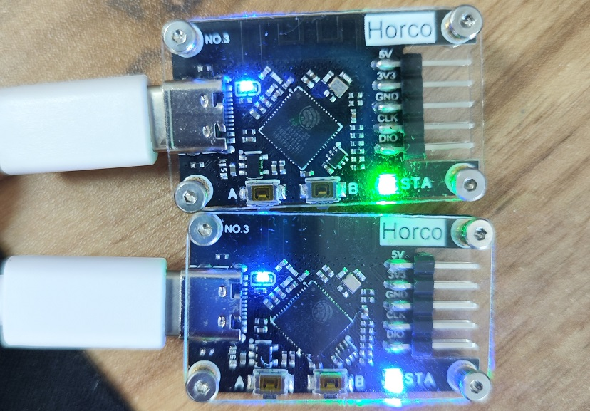

# Wireless DAPLink (ESP32-S3)

[中文](./readme.md) | **English**

> Open-source project: [dap_hs_esp_open](https://oshwhub.com/ylj2000/dap_hs_esp_open) (by ylj2000, on oshwhub)

Low-cost wireless debugger based on the ESP32-S3. Costs about 30 RMB while approaching the performance of the previous ~100 RMB design ([ch32v307](../ch32v307/readme_en.md)).

> 💡 For the newer design, see [ch32v208](../ch32v208/readme_en.md) (the recommended version in this repository).

## Background

Most wireless debuggers on the market are CMSIS-DAP based, but performance and price vary enormously — many sell poor performance at a high price. The previous CH32V307 + SX1281 design already brought the cost under 100 RMB; this project targets an even cheaper option that still performs well enough for everyday use.

## Design choices

- A HID-mode DAP cannot reach the target speed — the **WinUSB Bulk mode** is required.
- For cost reasons, an MCU with built-in USB + wireless was mandatory:
  - ESP32-S2: TinyUSB eats too much CPU; wired speed capped at 40+ KB/s. Rejected.
  - **ESP32-S3**: dual-core; with tasks split across both cores, wired speed exceeds 90 KB/s. Chosen despite the slightly higher price.

## Specifications & performance

| Item | Details |
|------|---------|
| **MCU** | ESP32-S3 (dual-core) |
| **USB mode** | WinUSB Bulk (not HID) |
| **Wireless** | WiFi channel |
| **Wired speed** | ~95 KB/s (MDK + STM32F4 program speed) |
| **Wireless speed** | Up to ~45 KB/s; ~40 KB/s in typical RF environments |
| **Cost** | ~30 RMB |

> Previous version (CH32V307) for reference: 98 KB/s wired, 48 KB/s wireless. This version delivers comparable performance at roughly one tenth the price of commercial products.

