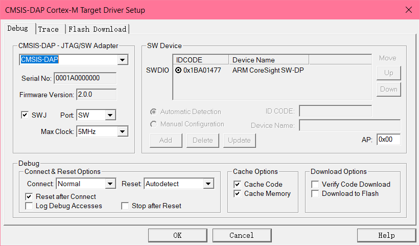
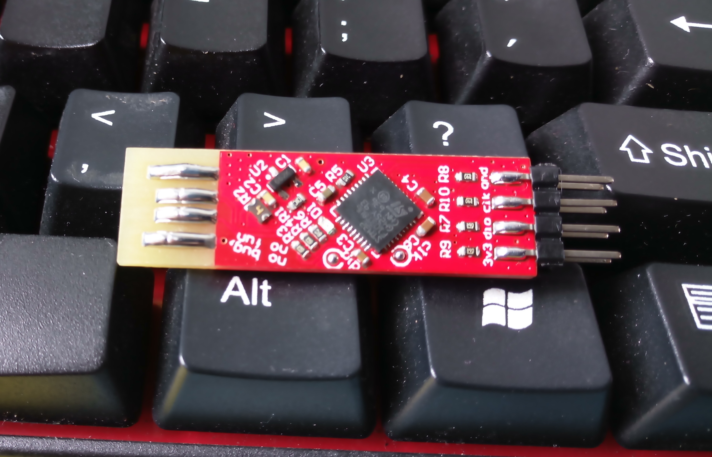
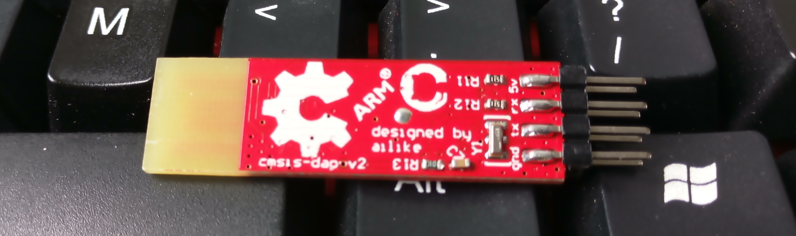

# CMSIS-DAP / DAPLink (STM32F103)

[中文](./readme.md) | **English**

Wired CMSIS-DAP debugger based on the STM32F103C8T6, with complete Keil project source and two Altium PCB projects; also includes the ARM-Mbed DAPLink Altium hardware project (firmware pending).

> The folder name `STM23F103x` is a historical typo — the actual chip is the STM32F103 series.

## CMSIS-DAP specifications

| Item | Details |
|------|---------|
| **MCU** | STM32F103C8T6 (Cortex-M3) |
| **Interfaces** | SWD + SWO + VCP (virtual COM port, CDC) |
| **Highlights** | Two variants (edge-connector / micro-USB), complete Keil project source |

## File manifest

| File | Description |
|------|-------------|
| `STM32F103C8T6_CMSIS-DAP_SWO-master.7z` | Complete Keil MDK project source |
| `金手指板CMSISDAP.pdf` | Edge-connector variant schematic |
| [电路/CMSIS-DAP_T8U6_PCB_Project/](<./电路/CMSIS-DAP_T8U6_PCB_Project/readme_en.md>) | Altium project (T8U6 variant), with `Sheet1.pdf` schematic |
| [电路/CMSIS_DAP_PCB_Project/](<./电路/CMSIS_DAP_PCB_Project/readme_en.md>) | Altium project, with DIY tutorial PDF |
| `电路/CMSIS_DAP_PCB_Project/CMSIS DAP DIY Tutorial (Chinese).pdf` | DIY tutorial (Chinese) |

### ARM-Mbed DAPLink hardware project (incomplete)

| File | Description |
|------|-------------|
| `DAPlink_STM32F103-v1.0.0.PrjPcb/` | Altium Designer project |
| `DAPlink_STM32F103-v1.0.0.PrjPcb/DAPlink_STM32F103-v1.0.0.SchDoc` | Schematic |
| `DAPlink_STM32F103-v1.0.0.PrjPcb/daplink.pdf` | Schematic / PCB exported PDF |
| [DAPLink使用手册.pdf](<./DAPlink_STM32F103-v1.0.0.PrjPcb/DAPLink使用手册.pdf>) | User manual (Chinese) |

> DAPLink firmware (bootloader + application) has not been organized/uploaded yet — contributions welcome. Target features: SWD + VCP + virtual USB drive (drag-and-drop flashing).

## ⚠️ Notes

- **SWJ must be enabled** in Keil settings, otherwise you get RDDI-ERROR.
- The firmware is modified: **PB5 (JNRST) is used as SWDIO**, different from the standard pin.
- Draw your own PCB (the projects in this repo can serve as reference).

## Photos

Recognized in Keil:

Assembled boards:

## Related links

- [Official DAPLink repository](https://github.com/ARMmbed/DAPLink)
- [CMSIS-DAP specification](https://arm-software.github.io/CMSIS_5/DAP/html/index.html)
