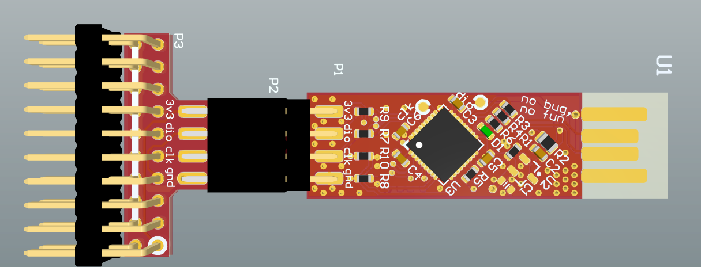
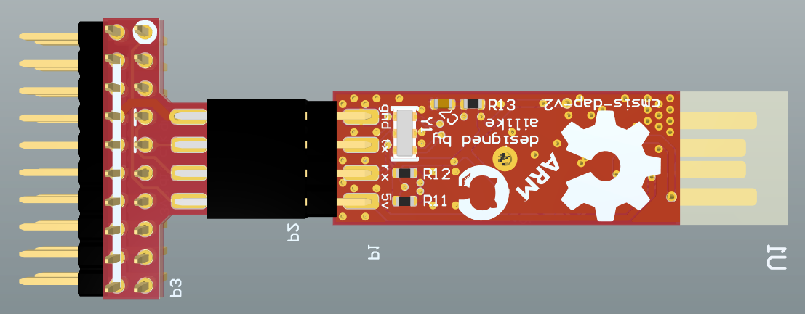

# CMSIS-DAP T8U6 PCB Project

[中文](./readme.md) | **English**

Altium Designer PCB project for the CMSIS-DAP (T8U6 variant). See the [parent readme](<../../readme_en.md>) for specifications and build notes.

## Files

| File | Description |
|------|-------------|
| `CMSIS-DAP_T8U6_PCB_Project.PrjPcb` | Altium project file |
| `Sheet1.SchDoc` | Schematic |
| `Sheet1.pdf` | Schematic PDF |

## PCB renders

