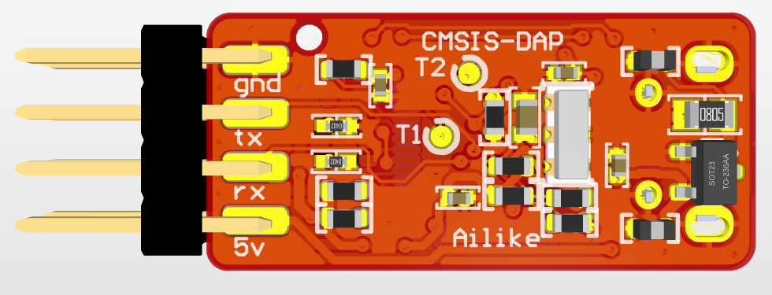

# CMSIS-DAP PCB Project

[中文](./readme.md) | **English**

Altium Designer PCB project for the CMSIS-DAP, with a DIY tutorial in Chinese. See the [parent readme](<../../readme_en.md>) for specifications and build notes.

## Files

| File | Description |
|------|-------------|
| `CMSIS_DAP_PCB_Project.PrjPcb` | Altium project file |
| `Sheet1.SchDoc` | Schematic |
| `CMSIS DAP DIY Tutorial (Chinese).pdf` | DIY tutorial (Chinese) |

## PCB render

