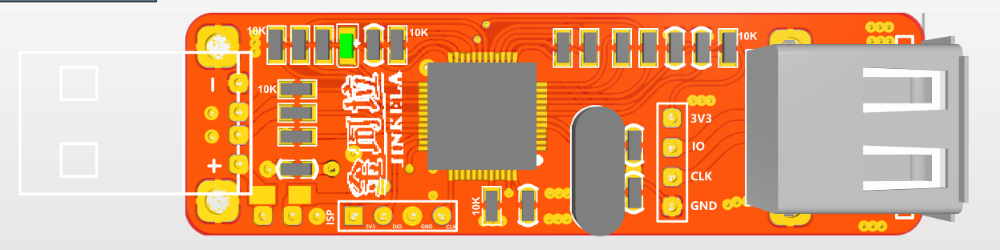
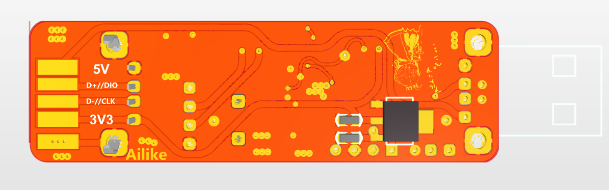
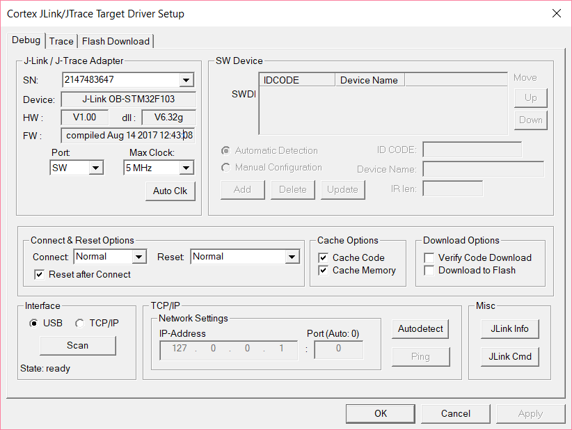

# J-Link OB（STM32F103 V1）

**中文** | [English](./readme_en.md)

基于 STM32F103C8T6 的 J-Link OB 自制调试器。

## 规格

| 项目 | 详情 |
|------|------|
| **MCU** | STM32F103C8T6 (Cortex-M3) |
| **接口** | SWD |

## 资料清单

| 文件 | 说明 |
|------|------|
| [2012版本(v7版)/Schematic_temp_ARM-OB_20180808014643.pdf](<./2012版本(v7版)/Schematic_temp_ARM-OB_20180808014643.pdf>) | 原理图 |
| `2012版本(v7版)/jlinkv7_pcb/jlink.PcbDoc` | PCB（Altium Designer），另有 `jlinkv7_pcb.7z` |
| `2012版本(v7版)/J-Link ARM-OB STM32 compiled Aug 22 2012.bin` | v7 固件 |
| `2012版本(v7版)/jlink_ob_c8t6.hex` | HEX 固件 |

## ⚠️ 版本说明

| 版本 | 状态 |
|------|------|
| `2012版本(v7版)` | ✅ 稳定可用 |
| `2017版本有问题,JFlash不能用` | ❌ J-Flash 无法使用，**不推荐** |

## 效果图

PCB 正反面：

Keil 成功识别：

升级过程截图见 [2012版本(v7版)/升级截图53.png](<./2012版本(v7版)/升级截图53.png>)；注意该版本[时不时会弹出警告](<./2012版本(v7版)/时不时会弹出警告.png>)。
