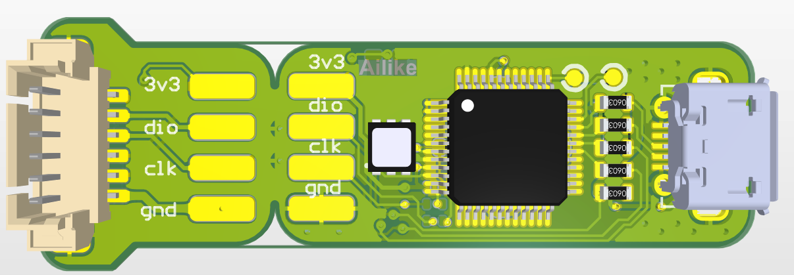
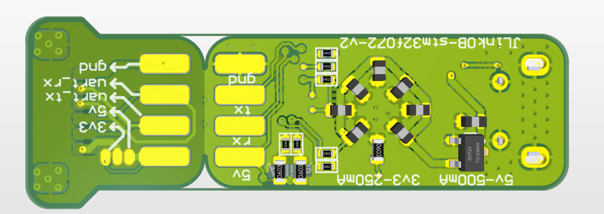

# J-Link OB 072 PCB 工程

**中文** | [English](./readme_en.md)

J-Link OB（STM32F072）的 Altium Designer 工程。规格与固件说明见[上级 readme](<../readme.md>)。

> `PCB请自己设计哦.txt` — PCB 请自己设计，压缩包仅供参考。

## 文件

| 文件 | 说明 |
|------|------|
| `JlinkOB_PCB_Project.PrjPcb` | Altium 工程文件 |
| `Sheet.SchDoc` | 原理图 |
| `PCB.7z` | PCB 压缩包 |
| `jlink-ob-com/` | 固件 + Windows 工具解包内容 |

## PCB 效果图

