# J-Link V9 制作

**中文** | [English](./readme_en.md)

基于 NXP LPC4322 的 J-Link V9 自制调试器，含原理图、PCB 工程、bootloader、固件工具及激活方法。

## 规格

| 项目 | 详情 |
|------|------|
| **MCU** | NXP LPC4322 (Cortex-M4) |
| **接口** | SWD + JTAG + VCP (虚拟串口) |
| **亮点** | 可升级的 bootloader，多个 USB 接口版本 |

## 资料清单

| 文件 | 说明 |
|------|------|
| [制作资料/JlinkV93.pdf](<./制作资料/JlinkV93.pdf>) | 原理图 |
| [制作资料/Jlinkv9mini_latest.pdf](<./制作资料/Jlinkv9mini_latest.pdf>) | V9 Mini 原理图 |
| `制作资料/jlinkv9mini_latest.7z` | V9 Mini PCB 工程（最新版，已打板验证） |
| `制作资料/jlinkv9_only_usbc.7z` | USB-C 专版 PCB 工程 |
| `制作资料/jlinkv9_taobao_version.7z` | 淘宝版 PCB 工程 |
| `制作资料/bootloader.bin` | Bootloader 固件 |
| `制作资料/bom.xls` | BOM 表 |
| [制作资料/top asm.pdf](<./制作资料/top asm.pdf>)、[btm asm.pdf](<./制作资料/btm asm.pdf>) | 装配图（正/反面） |
| `ひみつ/JLink_V9固件生成工具.rar` | 固件生成工具 |
| `ひみつ/jlink_v9固件升级资料.zip` | 固件升级资料 |
| [制作资料/jlink-v9激活.txt](<./制作资料/jlink-v9激活.txt>) | 激活命令（注意：文件为 GBK 编码） |

## 版本说明

- **初版**：多 USB 接口 + 排针组合（micro-USB / mini-USB / USB-C）
- **USB-C 专版**：仅 USB-C 接口，长时间插拔更可靠（`jlinkv9_only_usbc.7z`）
- **V9 Mini（最新版）**：已验证打板（`jlinkv9mini_latest.7z`），另见 [JlinkV9 mini](<../JlinkV9 mini/readme.md>) 独立项目

## 效果图

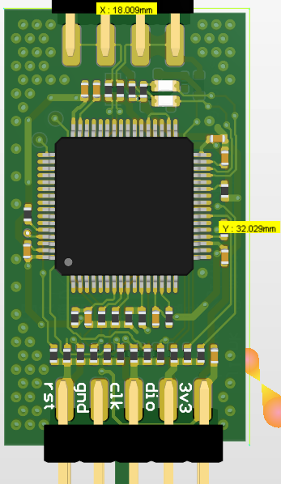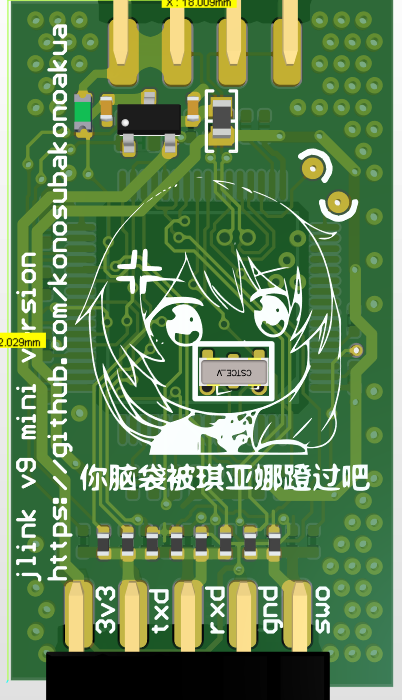

上图是 AD 渲染图，实际效果如下：

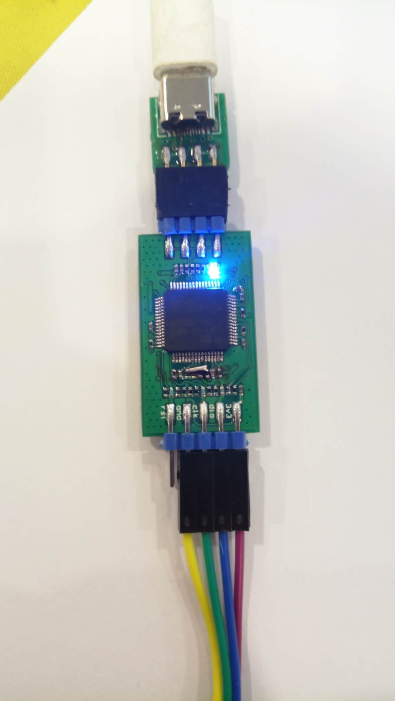

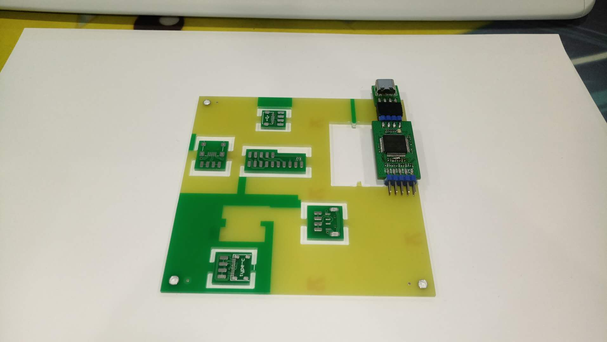

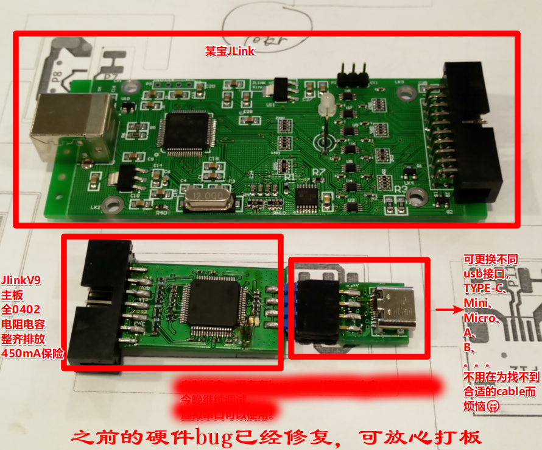

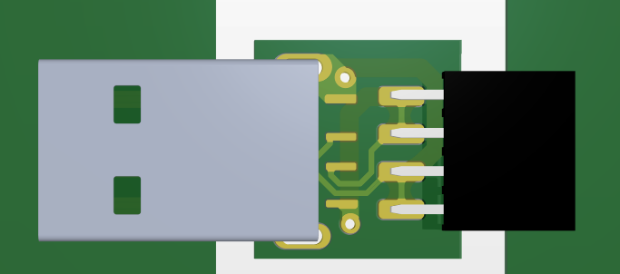

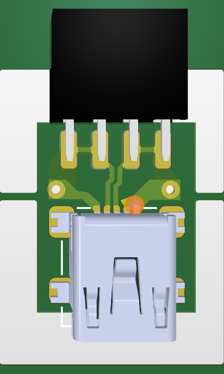

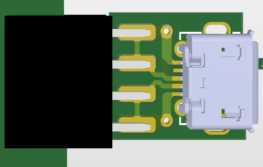

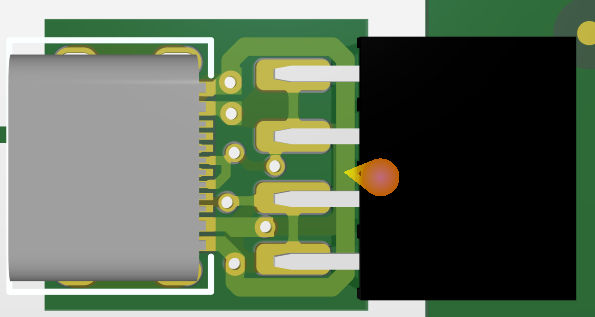

工程文件在压缩包里。

## 制作步骤

1. **焊接**：手焊大概半小时，建议使用刀头烙铁（0402 用尖头手抖就 🐶die）
2. **写入 bootloader**：通过 SWD 刷入 `制作资料/bootloader.bin`
3. **升级固件**：通过 J-Link Commander 自动升级
4. **激活**：在 J-Link Commander 里添加 S/N，然后添加 Licenses：

```
Exec SetSN=XXXXXXXX
Exec AddFeature GDB
Exec AddFeature RDI
Exec AddFeature FlashBP
Exec AddFeature FlashDL
Exec AddFeature JFlash
Exec AddFeature RDDI
```

> 将 `XXXXXXXX` 替换为你的序列号，详见 [制作资料/jlink-v9激活.txt](<./制作资料/jlink-v9激活.txt>)

5. 🎉 **完成**：

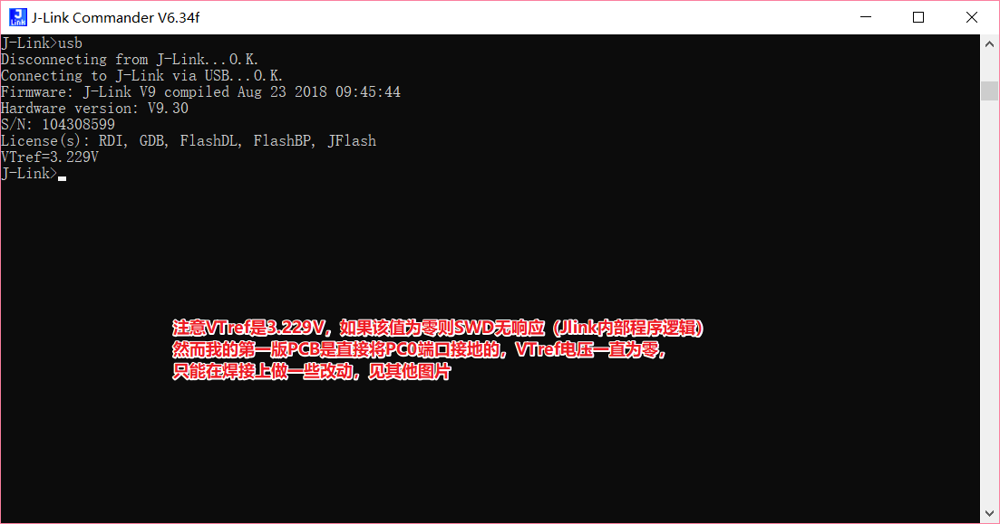

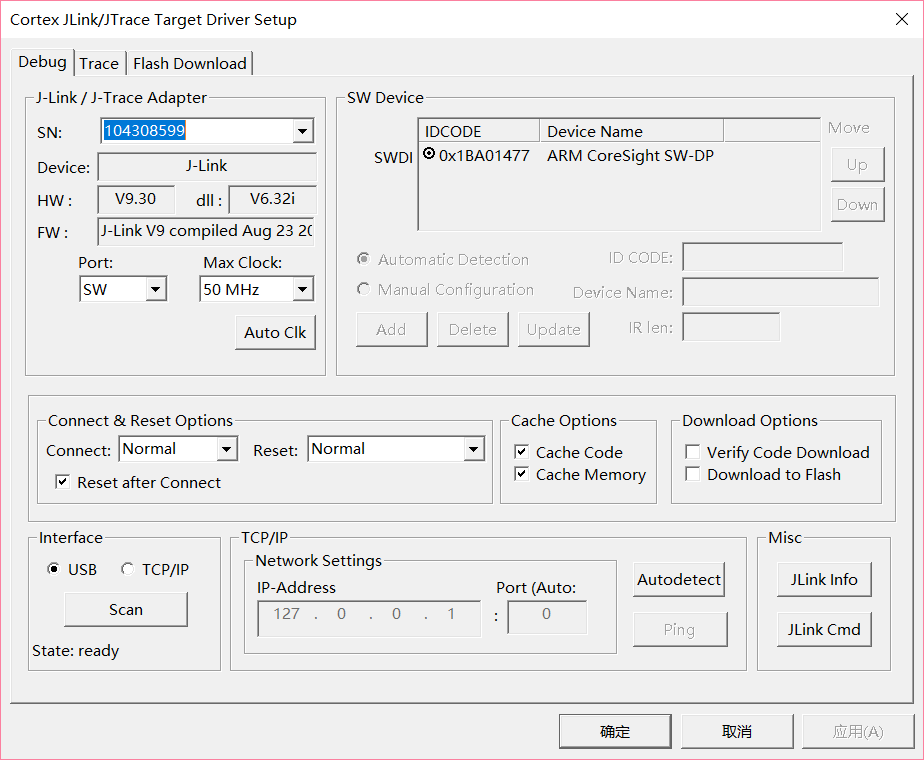

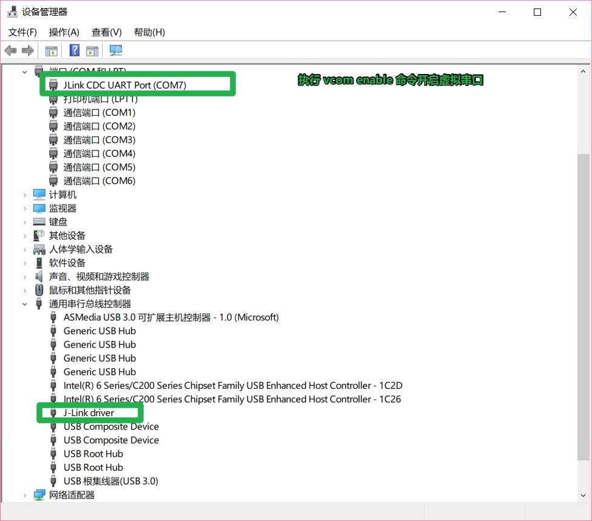

## 更新记录

之前使用多种 USB 接口 + 排针的方式，实际使用中拔插次数多了可能导致接触不良：


故更新一版只有 Type-C 接口的，PCB 文件是 `jlinkv9_only_usbc.PcbDoc`，效果如下（嘉立创🐂🍺，哑光黑不要钱）：

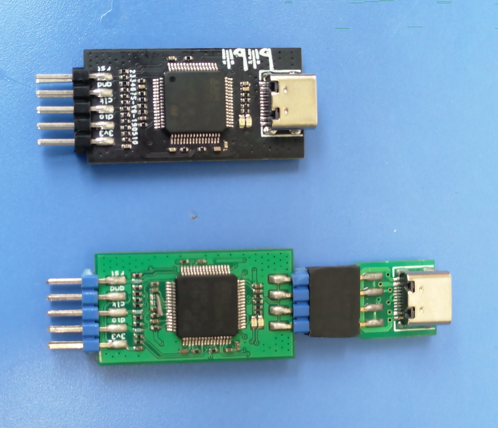
