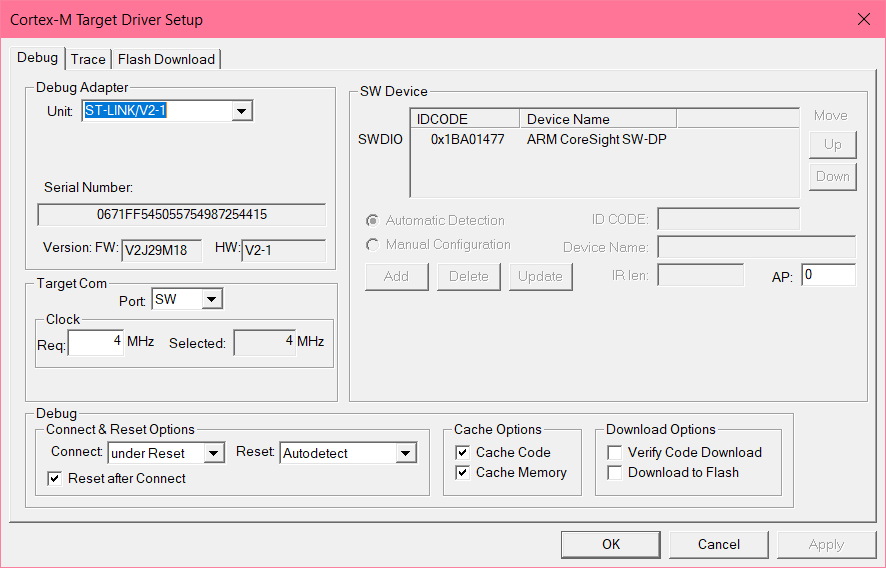
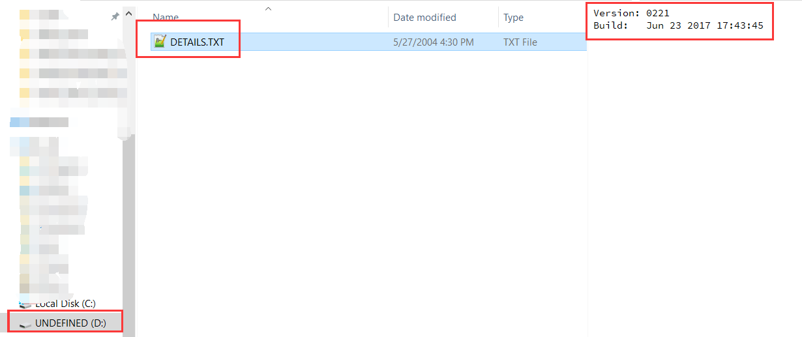
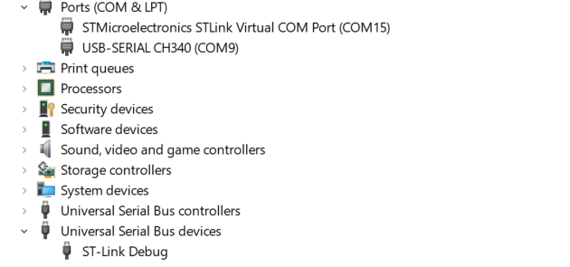
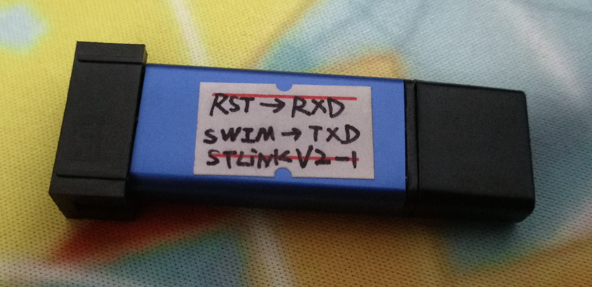
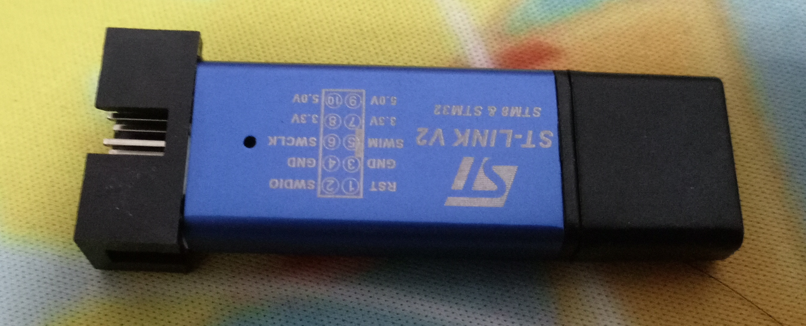

# ST-LINK V2-1（V2 魔改）

**中文** | [English](./readme_en.md)

将 ST-LINK V2 硬件魔改为 ST-LINK V2-1，获得虚拟串口 + 虚拟 U 盘功能。

## 规格

| 项目 | 详情 |
|------|------|
| **硬件** | 基于 ST-LINK V2 硬件魔改（STM32F103C8T6） |
| **接口** | SWD + VCP (虚拟串口) + 虚拟 U 盘 |

## 资料清单

| 文件 | 说明 |
|------|------|
| `STLinkV2.J28.M18_stlinkv2.1_bootloader.rar` | V2-1 bootloader |
| `STLinkV2.J28.M18_解除读保护.bin` | 已解除读保护的固件 |
| `STLINKV2 Firmware/STLinkV2.J27.S6.bin` | ST-LINK V2 固件备份 |
| `st-decrypt-master/` | Java 版 ST-LINK 固件解密/加密工具（第三方，见其 [README](./st-decrypt-master/README.md)） |
| [option_bytes_config.png](./option_bytes_config.png) | Option bytes 配置参考 |

## 制作步骤（极其简单）

1. 弄断（随便你怎么弄）SWIM 端口和 RST 端口与 PCB 之间的连线
2. 将 STM32 的 PA2、PA3 跳线连接到 SWIM 和 RST
3. 用另外一个 ST-LINK 以 SWD 方式连接到要魔改的 ST-LINK
4. 使用 ST-LINK Utility 解锁读保护并擦除芯片内容
5. 刷入 bootloader bin 文件
6. 使用 ST-LINK Utility 的 Firmware Update 自动升级固件
7. 完成，开始使用 ST-LINK V2-1 🎉

## st-decrypt 工具用法

```
java -jar st_decrypt.jar --key "best performance" -i firmware.bin -o firmware_decrypted.bin
```

## 刷写成功截图










